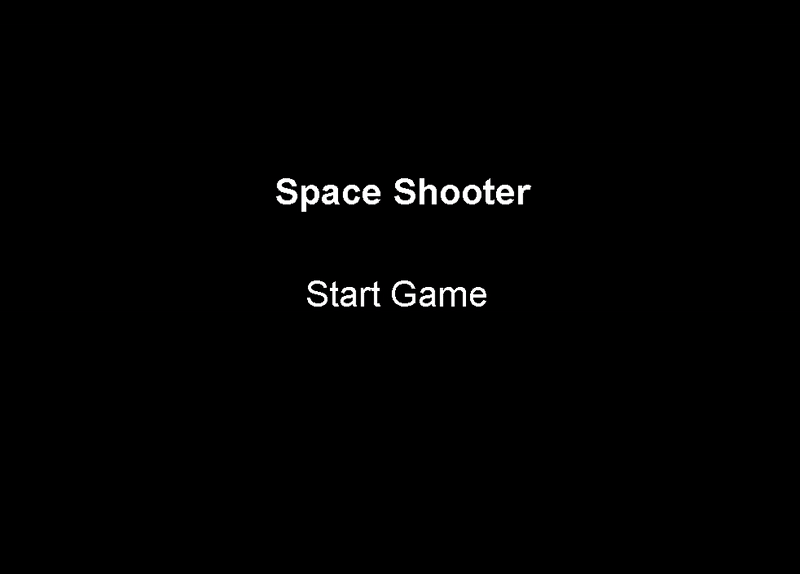

<div align="center">
    
   # 🚀 Space Shooter Game

</div>

A simple 2D Space Shooter game built using Java Swing. The player controls a spaceship, shoots enemies, and survives as long as possible while the game difficulty increases.

## 🎮 Game Features

- 🕹️ Player movement (left/right) using keyboard arrows
- 🔫 Shooting bullets with the Space key
- 👾 Randomly spawning enemies
- 💥 Collision detection between bullets and enemies
- ❤️ Health system and Game Over state
- ⬆️ Increasing difficulty with score and level progression
- 🧠 Organized OOP structure (Player, Bullet, Enemy, GamePanel)

## 🧠 Project Structure

```bash
src/
└── com/
    └── mycompany/
        └── spaceshooter/
            ├── SpaceShooter.java     # Main class
            ├── GamePanel.java        # Main game logic and rendering
            ├── Player.java           # Handles player movement
            ├── Bullet.java           # Handles bullets
            └── Enemy.java            # Handles enemy movement
```

## 🌀 Gameplay Preview

<div align="center">



</div>


## 💻 Technologies Used

- **Java**
- **Swing GUI**
- **NetBeans IDE 21**

## 🚀 How to Run the Game

1. Clone the repository:
   ```bash
   git clone https://github.com/M7md-Galal/space-shooter.git
   cd space-shooter
